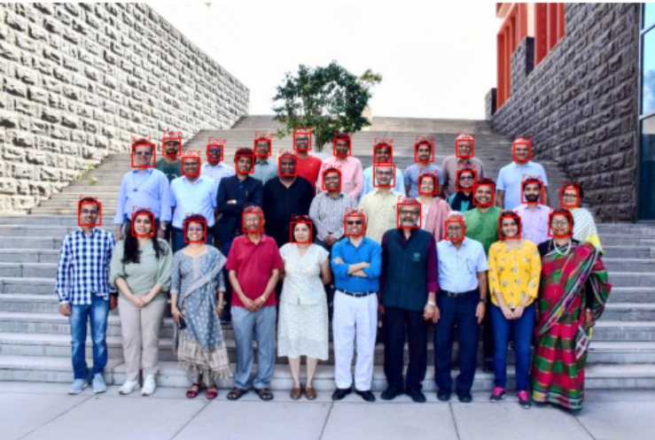
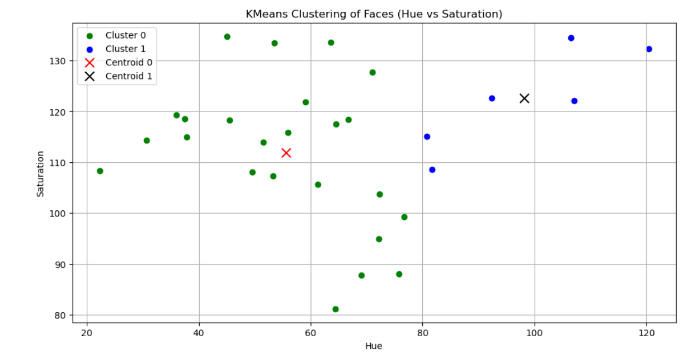
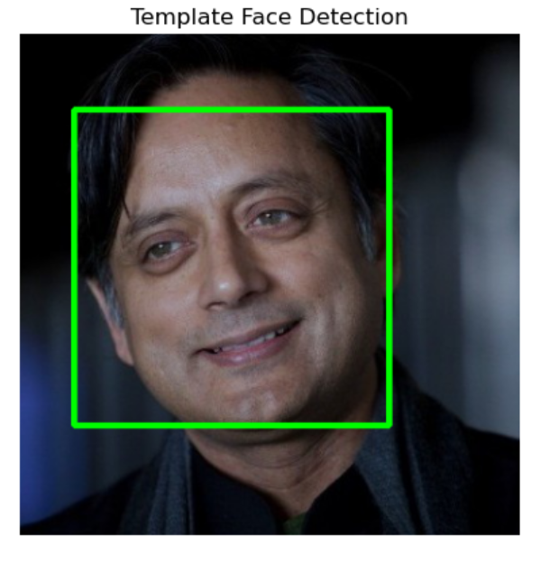
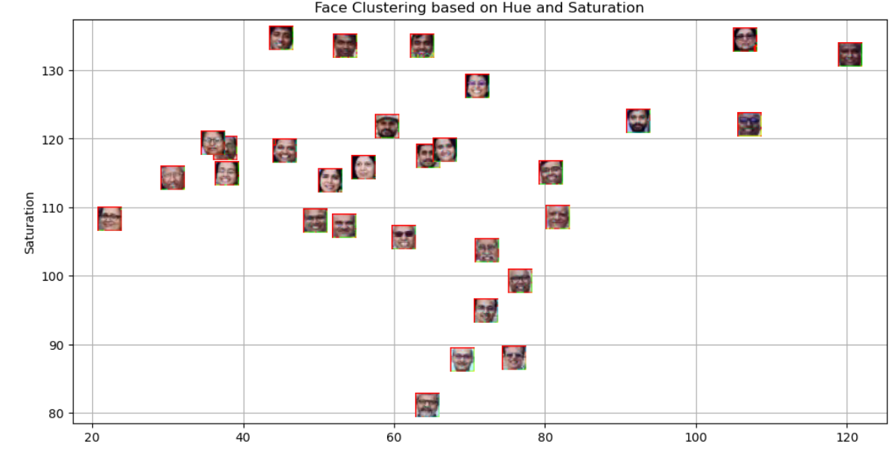

# Machine Learning and Pattern Recognition - Assignment 5

## Aim
To perform face detection using OpenCV and apply K-Means clustering on facial features.

## Methodology
- Used Haar Cascade classifier for face detection
- Converted image to HSV color space
- Extracted Hue and Saturation features from detected faces
- Applied K-Means clustering (k=2)
- Visualized clusters using scatter plots
- Classified a template image using trained model

## Key Findings
- Successfully detected 30 faces from the input image
- Faces were grouped into 2 clusters based on color features
- K-Means effectively separated faces with similar characteristics
- Template image was correctly classified into one cluster

## Results
- Face detection worked efficiently using OpenCV
- Clustering based on HSV features gave meaningful grouping
- Visualization helped understand distribution of clusters

## Results Visualization

### Face Detection

### KMeans Clustering Plot

### Template Face Detection

### Face Clustering Visualization

## Files Included
- Lab 5-Spring 2026.ipynb
- Plaksha_Faculty.jpg
- Dr_Shashi_Tharoor.jpg
- haarcascade_frontalface_default.xml
- README.md

## Conclusion
This lab demonstrates how computer vision and clustering techniques can be used together to analyze and group facial data effectively.

---

## Technologies Used
- Python
- OpenCV
- NumPy
- Matplotlib
- Scikit-learn
